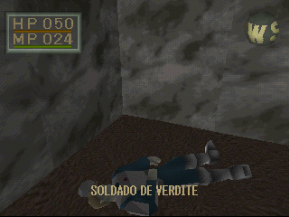
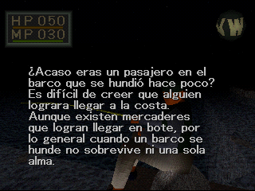
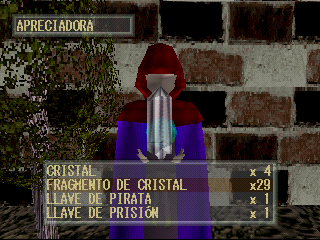
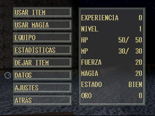

# King's Field 2 Spanish Patch
**King's Field 2 en Español** \
Spanish patch for King's Field 2 by FROMSOFTWARE, released outside of Japan simply as "King's Field". \
The translation is based mainly on the original Japanese text with elements from the official English translation. \
The patch is in xdelta format and should be applied to a `.bin` file of the game.

• [Instrucciones en español](patch/LEEME.md) \
• [King's Field 1 en español](https://github.com/MoonlightRuin/Kings-Field-Spanish-Translation-Patch)
# Tools used
[jpsxdec](https://github.com/m35/jpsxdec) \
[tim2view](https://github.com/lab313ru/tim2view) \
[TIM Viewer](https://www.romhacking.net/utilities/486/) \
[Kings Field Texture Tool](https://www.romhacking.net/utilities/1063/) \
[Delta Patcher](https://github.com/marco-calautti/DeltaPatcher) \
[CDMage](https://www.romhacking.net/utilities/1435/)
# Screenshots

